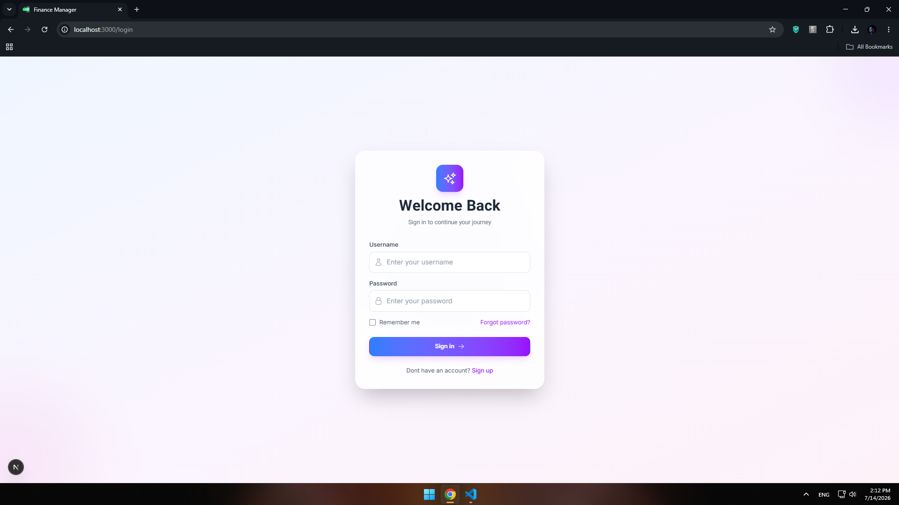
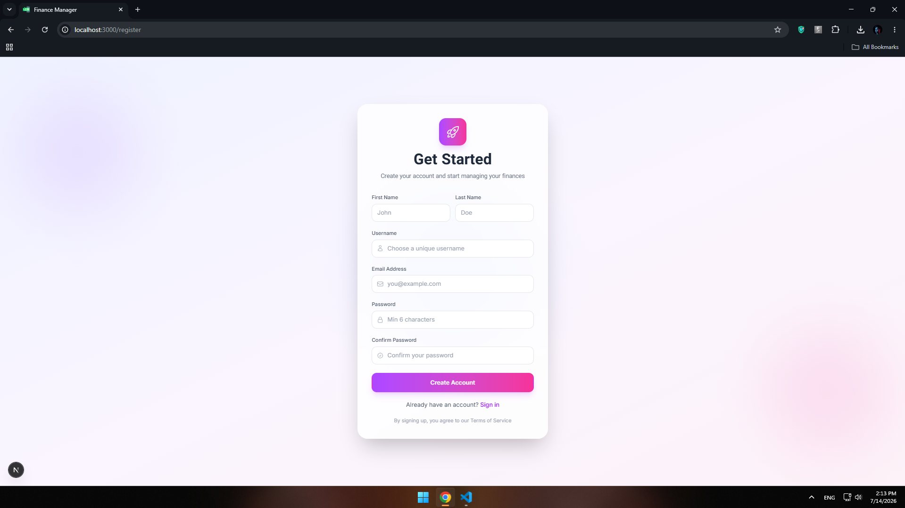
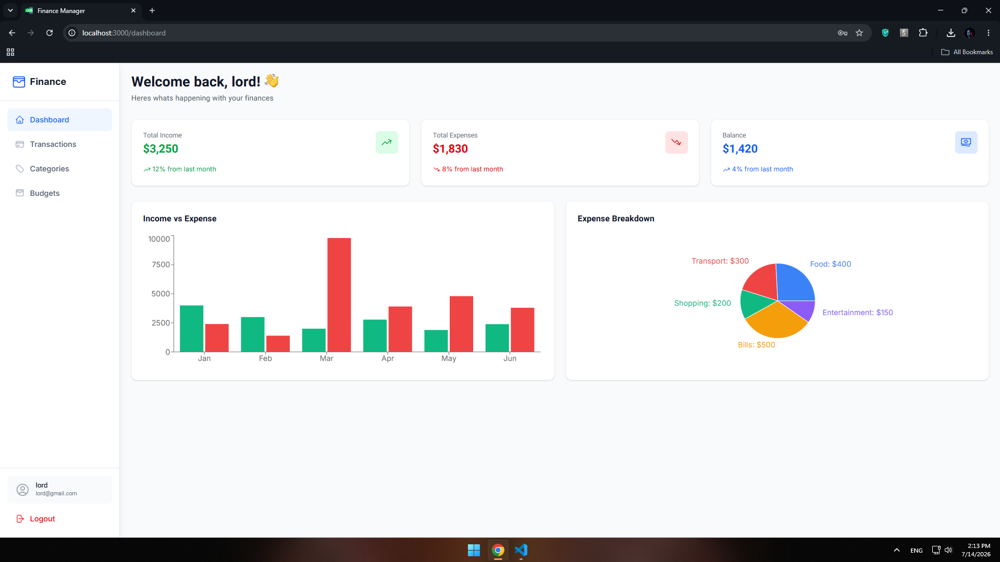
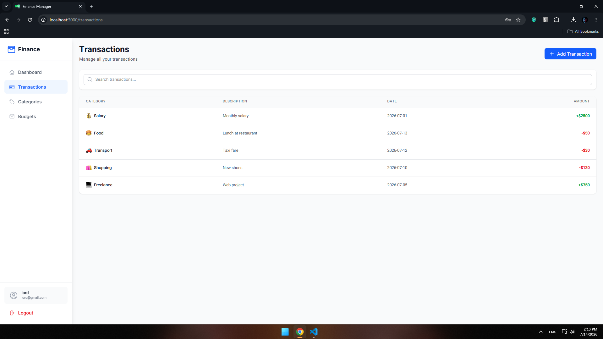
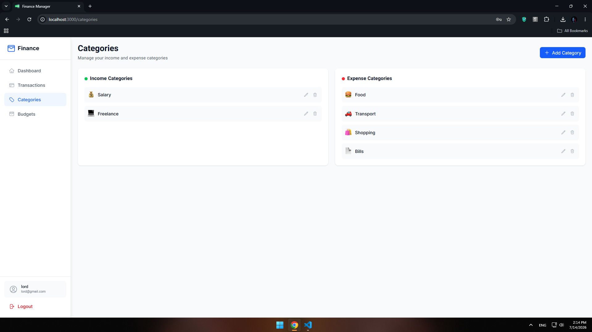
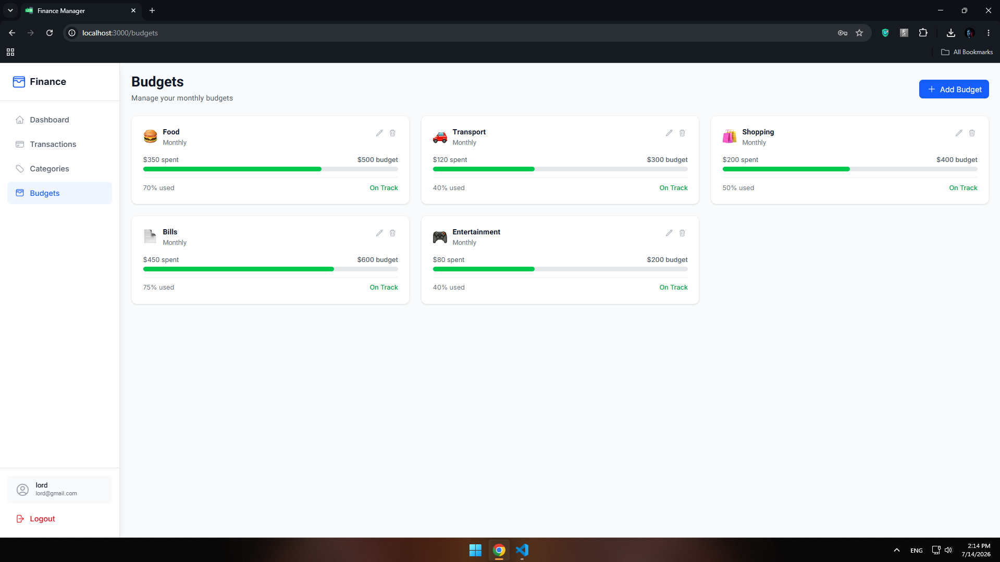

  
  <h1>💰 Finance Manager</h1>
  
<b>Track your money. Stay in control.</b> — A full-stack financial management platform built from scratch.

  
  
  
  
  
  

## 🚀 About Finance Manager

Finance Manager is a full-stack financial management web application. Users can track their income, expenses, manage budgets, and monitor their financial health — all with a clean, fast, and modern UI.

Built with **Next.js 14 App Router** on the frontend, **Django REST Framework** on the backend, fully typed with **TypeScript**, styled with **Tailwind CSS**, and powered by **SQLite**.

## ✨ Features

### 👤 User Features
- 🔐 **JWT Authentication** — Secure login & registration with access/refresh tokens
- 📊 **Dashboard** — Overview with income vs expense charts and statistics
- 💳 **Transactions** — Add, view, and manage all your financial transactions
- 🏷️ **Categories** — Organize transactions with custom income/expense categories
- 📈 **Budgets** — Set monthly budgets and track spending progress
- 📱 **Responsive Design** — Works on desktop and mobile devices
- 🌙 **Light Mode Only** — Clean and bright user interface

### 🛠️ Admin Panel
- 🔒 **Django Admin** — Built-in admin panel for managing all data
- 📋 **User Management** — View and manage all registered users
- 🗑️ **CRUD Operations** — Full control over transactions, categories, and budgets

## 🧠 Tech Stack

| Layer | Technology | Purpose |
|-------|-----------|---------|
| 🖥️ Frontend | Next.js 14 (App Router) | SSR, routing, API integration |
| 🟦 Language | TypeScript | Type safety across the entire app |
| 🎨 Styling | Tailwind CSS | Utility-first styling |
| 🔙 Backend | Django 5.0 + Django REST Framework | RESTful API, business logic |
| 🗄️ Database | SQLite | Development database |
| 🔐 Auth | JWT (Simple JWT) | Token-based authentication |
| 📊 Charts | Chart.js + Recharts | Interactive data visualization |
| 🔣 Icons | Heroicons | Clean icon set |

## 🗄️ Database Schema

**User (Custom)** — username, email, first_name, last_name, phone, avatar, currency (IRR, USD, EUR), created_at, updated_at

**Category** — name, type (INCOME / EXPENSE), icon, color, user (ForeignKey), is_default, created_at

**Transaction** — user (ForeignKey), category (ForeignKey), amount, type (INCOME / EXPENSE), description, date, payment_method (CASH, CARD, BANK_TRANSFER, CHECK, ONLINE), receipt, is_recurring, recurring_period, created_at, updated_at

**Budget** — user (ForeignKey), category (ForeignKey), amount, period (MONTHLY / QUARTERLY / YEARLY), month, year, created_at, updated_at

## 🖼️ Project Preview

  
    
  
    
  
    
  
    
  
    
  

## ⚙️ Getting Started

### 1. Clone the repo

git clone https://github.com/yourusername/finance-manager.git
cd finance-manager
2. Backend Setup
bash
cd backend
python -m venv venv
source venv/bin/activate
On Windows:

venv\Scripts\activate
bash
pip install -r requirements.txt
python manage.py makemigrations
python manage.py migrate
python manage.py createsuperuser
python manage.py runserver
3. Frontend Setup
bash
cd frontend
npm install
npm run dev
4. Environment Variables
Create .env.local in frontend:

env
NEXT_PUBLIC_API_URL=http://127.0.0.1:8000/api
5. Open http://localhost:3000 🚀
🔐 Authentication Flow
Register — User creates account with username, email, and password

Login — User receives JWT access and refresh tokens

Auth Interceptor — Tokens automatically added to all API requests

Token Refresh — Access token automatically refreshed when expired

Logout — Tokens cleared from localStorage and user redirected to login

📡 API Endpoints
Method	Endpoint	Description
POST	/api/auth/register/	Register new user
POST	/api/auth/login/	Login & get tokens
POST	/api/auth/refresh/	Refresh access token
GET	/api/auth/profile/	Get user profile
GET	/api/transactions/	List all transactions
POST	/api/transactions/	Create transaction
GET	/api/transactions/summary/	Get financial summary
GET	/api/transactions/monthly_report/	Get monthly report
GET	/api/categories/	List categories
POST	/api/categories/	Create category
GET	/api/budgets/	List budgets
POST	/api/budgets/	Create budget
🔒 Security
JWT-based authentication with refresh tokens

Token rotation on refresh

All API endpoints protected with authentication

CORS properly configured for Next.js frontend

User-specific data isolation

CSRF protection enabled

👨‍💻 Author
Developed by: HamiParsa

     <i>Built with ❤️ and a lot of ☕</i> 
 
